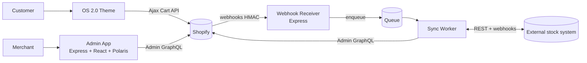

# Shopify Production Foundation

> A reusable base for Shopify client work — an Online Store 2.0 theme, an embedded
> admin app, and an integration layer — with the platform's sharp edges already
> handled rather than discovered under deadline.
>
> **NORDLYS** is the reference implementation: a DTC skincare brand on a
> development store, used to exercise the whole stack end to end. The brand and
> the external ERP are stand-ins; the architecture, the code and the measurements
> are not.

**Status: theme complete, admin app running locally.** Phase 1 of the
[roadmap](docs/roadmap.md) is closed and phase 2 is most of the way there; the
roadmap carries per-item status and is the authoritative list.

**Live**
- **Storefront:** not yet published — will be a Shopify preview URL with the
  development store password
- **App:** an embedded admin app cannot be opened outside a store's admin, so it
  runs locally and is demonstrated by video; deployment topology and rationale are
  in [ADR-0008](docs/adr/0008-hosting-topology.md).
- **Code:** this repository

---

## Why this exists

Every Shopify project re-solves the same problems, usually late:

- Webhook handlers that break on redelivery, because delivery is at-least-once
  and nothing deduplicates.
- Admin API loops that fall over on a real catalog, because nothing reads
  `throttleStatus` and nothing backs off.
- Mutations that return 200 and silently do nothing, because `userErrors` went
  unhandled.
- Content modelled as metafields where it belongs in metaobjects, then duplicated
  across products until the two drift apart.
- Themes where the merchant cannot change anything without a developer, because
  sections shipped without complete schemas.

This repository solves them once, with the reasoning recorded, so a client
project starts from a base instead of from Dawn plus improvisation.

## What is in it

| Area | Contents | Status |
|---|---|---|
| **Theme** (OS 2.0) | Dawn-based, custom sections with complete schemas, metaobject-driven content, bundle builder on the Ajax Cart API | done — Phase 1 |
| **App** | Embedded admin app: OAuth with offline and online tokens, Polaris UI, Admin GraphQL with cost-aware throttling and bulk operations | in progress — Phase 2. OAuth, session storage, store preparation and the bundle index are in; editing, the sync log and bulk operations are not |
| **Integration** | HMAC-verified idempotent webhook intake, queue on a PostgreSQL table with backoff and a DLQ status, inventory sync | planned — Phase 3 |
| **Decisions** | ADRs for the stack, the database and ORM choice, and hosting topology | done |
| **Quality** | CI with typecheck, lint, tests, theme-check, secret scanning and Lighthouse budgets | CI configured; tests follow the code |

## Architecture



## Reference implementation

NORDLYS exercises the base against a realistic set of requirements, so the
foundation ends up proven rather than asserted. The three it has to handle:

1. **Custom routine sets.** Shopify has no native concept for them, so every set
   becomes a separate product — bloating the catalog and splitting inventory.
   Handled by the bundle builder, with line items linked by a `_bundle_id`
   line item property.
2. **Product page performance.** Measured before and after; see below.
3. **Inventory drift** between Shopify and an external system. Handled by
   idempotent webhook intake and a queue with retries.

### Storefront walkthrough

What to look at, and in what order, on the home page:

1. **Build your routine** — the bundle builder, and the one place where the
   interaction is not what it looks like. Each step shows product cards, but
   they are choices, not links: a card is a `<label>` wrapping
   `<input type="radio">`, so the browser enforces "exactly one per step" and
   supplies the keyboard handling and the group name. Click one card in each of
   the three steps — the picked card gains a border and a **Selected** badge —
   and **Add routine to cart** enables. It adds all three products in a single
   `/cart/add.js` request, all-or-nothing, with the lines linked by a
   `_bundle_id` property. Reasoning, and the four rejected alternatives, in
   [ADR-0012](docs/adr/0012-bundle-add-to-cart-transaction.md).
2. **A product page** — reached from **Catalog** or from the product grids,
   where cards *are* links. Ingredients come from metaobjects rather than
   duplicated metafields ([ADR-0003](docs/adr/0003-metaobjects-for-ingredients.md));
   the measured LCP and Speed Index gains below are on this page's template
   and the home page.
3. **The cart** — a cart notification rather than a drawer, and why, in
   [ADR-0014](docs/adr/0014-cart-notification-over-drawer.md).

Every custom section carries a complete schema with `presets`, so all of the
above is configurable in the theme editor without touching code.

## Measured results

Home page, mobile, median of five runs against the real CDN with Shopify's
preview bar blocked. Method, per-optimisation breakdown and the raw run data are
in [`docs/performance/`](docs/performance/) — including what was already Dawn's
and is not being claimed, and what did not work.

| Metric | Before | After |
|---|---|---|
| LCP (mobile) | 5441 ms | 3031 ms |
| Speed Index (mobile) | 4609 ms | 2817 ms |
| CLS | 0.000 | 0.000 |
| TBT (lab proxy for INP) | 159 ms | 137 ms |
| Lighthouse Performance | 72 | 90 |
| Lighthouse Accessibility | 97 | 100 |

**No INP figure.** INP is a field metric and a Lighthouse lab run cannot produce
one; TBT is the lab proxy and is what the table reports. Desktop went 99 → 98,
which is noise: there was no performance headroom there to recover. The
accessibility gain is real on both form factors.

## Engineering notes

Design decisions already made; each becomes a link to the implementing code as
the phases land.

- **Idempotent webhook handling.** Shopify guarantees at-least-once delivery, so
  duplicates are inevitable. Deduplication uses a unique index and
  `ON CONFLICT DO NOTHING` — not a `SELECT`-then-`INSERT` check, which is a race.
  The endpoint responds 200 before any work begins; the work goes to the queue.
- **Working within Admin GraphQL rate limits.** …
- **Bulk operations instead of pagination.** …
- **Bundle builder without libraries.** …

## Using this as a project base

```bash
docker compose up -d
pnpm install
cp .env.example .env          # then fill in the app credentials
pnpm prisma migrate dev
pnpm dev
```

Already running PostgreSQL? Skip Docker and set `DATABASE_URL`.

The app is embedded, so `pnpm dev` alone is not enough to see it: it has to be
reachable over HTTPS and opened inside a store's admin. `shopify app dev`
provisions that tunnel — see [`docs/development.md`](docs/development.md).

Conventions and hard rules that any code here must follow are in
[`CLAUDE.md`](CLAUDE.md); setup detail in
[`docs/development.md`](docs/development.md).

Once the phases land, starting a client project from this base means replacing
the brand tokens and the sections under `theme/sections/`, keeping the webhook
intake, queue and Admin API layer as they are, and swapping the NORDLYS
metaobject definitions for the project's own content model.

## Beyond the current roadmap

Designed and reasoned about, but outside even the planned phases — recorded so
the boundary is deliberate rather than accidental:

- Shopify Function for bundle discounts.
- Checkout UI extension.
- Two-way sync with a DLQ and conflict resolution.
- Rebasing the theme on Shopify's Skeleton theme — [ADR-0011](docs/adr/0011-dawn-over-skeleton-theme.md).

## Authorship

All code, architecture and decisions are mine. Development is AI-assisted; the
approach, its boundaries, the data that is never shared with a model, and the
model mistakes caught in review are documented in
[`docs/ai-workflow.md`](docs/ai-workflow.md).

## Documentation

- [Roadmap and scope boundaries](docs/roadmap.md)
- [Local development](docs/development.md)
- [Architecture Decision Records](docs/adr/)
- [Estimates and actuals](docs/estimates.md)
- [AI-assisted workflow](docs/ai-workflow.md)
- [Performance measurements](docs/performance/)

## Development store constraints

- The storefront is always password-protected; that is a platform constraint,
  not a setting.
- Real payments are not possible; test orders go through the Bogus Gateway.
- The theme will be published as a preview on Shopify's CDN: stable URL, always
  available, no hosting cost.
